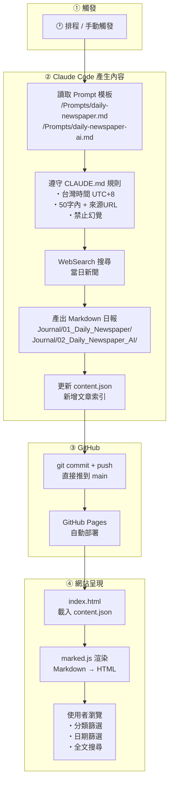
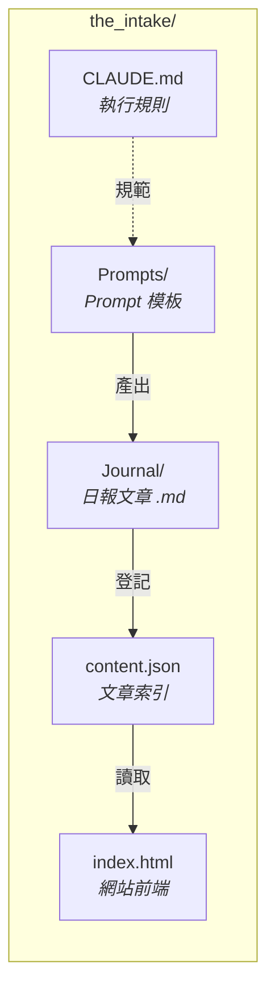

# The Intake — 專案流程圖

## 整體架構

## 檔案結構

## 三個核心角色

| 角色 | 負責什麼 | 怎麼運作 |
|------|----------|----------|
| **Claude Code** | 內容產生 | 讀 Prompt 模板 + WebSearch 搜新聞 → 寫 Markdown 日報 + 更新 content.json |
| **Schedule** | 定時觸發 | 每日排程（或手動）啟動 Claude Code 執行 Prompt |
| **GitHub** | 儲存 + 部署 | Git 版控所有檔案，GitHub Pages 自動將 main branch 部署為靜態網站 |

## 一句話總結

> **排程觸發 Claude Code → 自動搜尋新聞寫日報 → push 到 GitHub → GitHub Pages 自動上線**
>
> 零後端、零資料庫，整個網站就是一個 Git repo + 靜態頁面。
